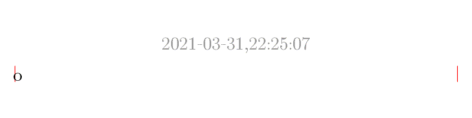

# Repositorio para aprender a hacer Pull Requests
¿Te gustaría contribuir con un proyecto, pero necesitas aprender a hacer un pull request?
Este es el lugar perfecto.
Este es un repo automatizado para aceptar o rechazar tu pull request, 
perfecto para cometer errores y aprender. Nadie te juzgará. ¡Atrévete!

# Misión
Agregar un nuevo archivo en `balls/' que contenga sólo un caracter o emoji.
Eso hará que se genere un nuevo gif con el mismo nombre en la carpeta `gifs`. 
El gif más recientemente generado se llamará `gifs/latest.gif` y siempre se mostrará a continuación:

# Requisitos
Debes tener instalado en tu computadora como mínimo:
* git

Si quieres hacer algo más elaborado o probar en local, debes tener instalado python 3.x y la librería flake8, 
(pero es opcional)

# ¿Cómo hacer un Pull Request?

Primer paso: hacer un fork the este proyecto en github.
[GIF]
Comandos:
Comentario técnico:

Segundo paso: Clonar TU repositorio a tu notebook.
[GIF]
Comandos:
Comentario técnico:

Tercer paso: Setear que el upstream corresponda al repositorio original
[GIF]
Comandos:
Comentario técnico:

Cuarto paso: Crear una nueva rama donde agregar contenido
[GIF]
Comandos:
Comentario técnico:

Cuarto paso: Agregar contenido mediante varios commits
[GIF]
Comandos:
Comentario técnico:

Quinto paso: "Unir" los commits en uno solo 
[GIF]
Comandos:
Comentario técnico:

Sexto paso: Hacer un push 
[GIF]
Comandos:
Comentario técnico:

Séptimo paso: Hacer un Pull Request 
[GIF]
Comandos:
Comentario técnico:

Octavo paso: Celebrar 
[GIF] Michael Jackson
Comandos: No tiene
Comentario técnico: Cuidar el equilibrio. Acá para un tutorial.

Recursos:
* https://www.pythoninformer.com/python-libraries/pillow/creating-animated-gif/
* https://stackoverflow.com/questions/17353619/rendering-emoji-with-pil
* Symbola font: https://github.com/gearit/ttf-symbola
